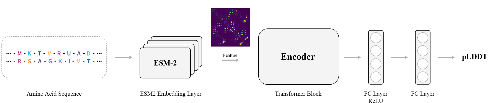
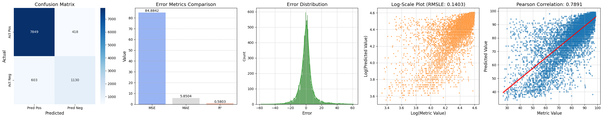

# pLDDT-Predictor


## Abstract
Recent advancements in protein structure prediction, particularly AlphaFold2, have revolutionized structural biology by achieving near-experimental accuracy. However, the computational intensity of these models limits their application in high-throughput protein screening. Concurrently, large language models like ESM (Evolutionary Scale Modeling) have demonstrated the potential to extract rich structural information directly from protein sequences. Despite these advances, a significant gap remains in rapidly assessing protein structure quality for large-scale analyses.

We introduce **pLDDT-Predictor**, a high-speed protein screening tool that bridges this gap by leveraging pre-trained ESM2 protein embeddings and a Transformer architecture to accurately predict AlphaFold2's pLDDT (predicted Local Distance Difference Test) scores. Our model addresses the critical need for fast, accurate protein structure quality assessment without the computational burden of full structure prediction. By combining the evolutionary information captured in ESM2 embeddings with the sequence-wide context modeling of Transformers, pLDDT-Predictor achieves a balance between structural insight and computational efficiency.

Our experimental results, conducted on a diverse dataset of 1.5 million protein sequences, demonstrate that pLDDT-Predictor can classify more than 90 percent of proteins with a pLDDT score above 70, closely matching AlphaFold2's confidence level.

## Main Results


- More than **90%** of proteins were classified with a pLDDT score above 70.
- More than **80%** were classified with a pLDDT score above 90.

## Quick Inference
### Installation
To set up the environment, ensure you have Conda installed. Then run the following command to install the dependencies from the `environment.yml` file:

```bash
conda env create -f environment.yml
conda activate plddt_predictor
```

### Usage

#### For Trial Run (for single Dataset):

To run the model with default paths and hyperparameters, simply execute the following command without any additional arguments:

```bash
python predict.py
```

#### Custom Parameters(large scale json file prediction):

To specify custom file paths and hyperparameters, use the following format:

```bash
python predict.py --input_json_path your_input_file.json \
                  --output_json_path your_output_file.json \
                  --model_path your_model.pth \
                  --hidden_dim 1024 --num_heads 16 --num_layers 8 --dropout 0.1
```

**Parameters Explanation:**
- `--input_json_path`: Path to the input JSON file containing protein sequences.
- `--output_json_path`: Path to the output JSON file where predictions will be saved.
- `--model_path`: Path to the pre-trained model.
- `--hidden_dim`: The hidden dimension size for the Transformer model.
- `--num_heads`: Number of attention heads in the Transformer model.
- `--num_layers`: Number of layers in the Transformer model.
- `--dropout`: Dropout rate for the Transformer model.

  
By default, the following files and settings will be used:
- Input file: `plddt_predictor/sample_data/sampled_protein_data.json`
- Output file: `plddt_predictor/sample_data/test_output.json`
- Model file: `plddt_predictor/saved_models/protein_gat_transformer1024_best_model.pth`
- 
#### Example Command:

```bash
python predict.py --input_json_path plddt_predictor/sample_data/sampled_protein_data.json \
                  --output_json_path plddt_predictor/sample_data/test_output.json \
                  --model_path plddt_predictor/saved_models/protein_gat_transformer1024_best_model.pth
```

This command will quickly process the input sequences and save the prediction results to the specified output file.

### Sample Data

Sample input and output files are provided for quick testing:
- **Input data**: `plddt_predictor/sample_data/sampled_protein_data.json`
- **Output data**: `plddt_predictor/sample_data/test_output.json`

